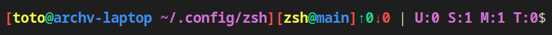

# personal dotfiles
Requires:
```
git trash-cli zsh-syntax-highlighting
```

## .zshrc

### Prompt

Prompt changes dinamically if a script `.config/zsh/.shell_prompt` exists, otherwise fallback to a custom prompt.
`fast-syntax-highlighting` is used for coloring.

### removing files

aliased `rm -i` as fallback when other "removal protection" aliases are defined.

### other options

- history
- auto cd
- auto completion with tab

## .zsh_aliases

- `rm` uses is redefined to use `trash` instead

other options are just shortcuts.

## .shell_prompt

same as default prompt with `$additional` variable at the end to modify it at runtime

### git_status



the method check if the directory is a git repo and if has a remote. if both are true:

- [x] retrieves info
- [x] styles with colors
- [ ] changes colors based on value
- [x] constructs the exit_status string
